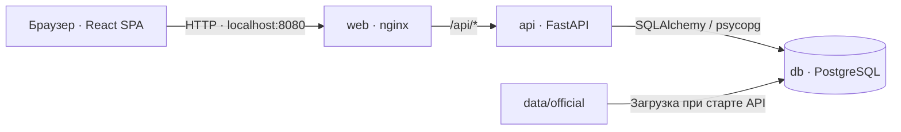

# Career Quest — «Мой рост»

Career Quest — демонстрационное веб-приложение для карьерного развития сотрудников с интерфейсом Halyk «Мой рост». Оно объединяет текущую должность и грейд, карьерную цель, навыки, требования роли и историю обучающих активностей. Сотрудник может увидеть свою текущую позицию, сопоставить навыки с требованиями и понять, на что обратить внимание при дальнейшем развитии.

Идея проекта — сделать профессиональное развитие наглядным через образ растущего дерева. В текущей версии дерево служит иллюстрацией; профиль, навыки, цель и история загружаются из базы данных. Оболочка Halyk демонстрирует вход в сервис «Мой рост», но не подключена к банковским системам.

В репозитории реализованы вход через синтетические учётные записи, навигация по сервису «Мой рост», просмотр личного профиля и управление датой демонстрации. Все люди и компании в наборе вымышлены.

## Быстрый запуск для проверяющего

### Что потребуется

- Docker Desktop либо Docker Engine с плагином Docker Compose v2; Docker должен быть запущен.
- Браузер и свободный локальный порт `8080`.
- Интернет при первой сборке для загрузки образов и зависимостей.

Устанавливать Python, Node.js или PostgreSQL на компьютер отдельно не нужно. Для текущего инкремента внешние API-ключи и файл `.env` не требуются.

### Запуск

1. Скачайте репозиторий или распакуйте архив проекта.
2. Откройте терминал в корне проекта — рядом с `docker-compose.yml`.
3. Проверьте доступность Docker и запустите приложение:

   ```sh
   docker --version
   docker compose version
   docker compose up -d --build
   ```

4. Проверьте состояние контейнеров:

   ```sh
   docker compose ps
   ```

   Ожидается: `db` и `api` имеют статус `healthy`, `web` — `Up`. Первая сборка может занять несколько минут.

5. Откройте **[http://localhost:8080](http://localhost:8080)**.

При старте автоматически создаётся база PostgreSQL, применяются миграции Alembic и загружается официальный набор данных версии `1.0`. Повторный запуск не дублирует исходные записи.

Дополнительная проверка API (в браузере или через `curl`):

```sh
curl -fsS http://localhost:8080/api/health
```

Ответ должен содержать `"status":"ok"`, `"dataset_version":"1.0"` и `"as_of_date":"2026-10-01"`. Если оператор ранее менял дату, вернётся сохранённая дата сценария.

## Сценарий проверки

### 1. Вход и профиль сотрудника

1. На стартовом экране введите в поиск `E0003` или другой ID, имя, роль либо подразделение из набора.
2. Нажмите на найденного сотрудника. Пароль не нужен: это демонстрационный выбор учётной записи.
3. В оболочке Halyk откройте сервис **«Мой рост»**, затем вкладку **«Профиль»**. Проверьте ID, имя, должность, грейд и подразделение выбранного сотрудника.
4. Посмотрите карьерную цель, навыки с текущими уровнями и требованиями роли, а также историю активностей со статусами.
5. Обновите страницу: выбранная учётная запись должна сохраниться в пределах срока сессии (4 часа).
6. Нажмите **«Выйти»**, чтобы вернуться к выбору аккаунта и открыть другого сотрудника, например `E0174`.

Отсутствие карьерной цели у части сотрудников — допустимое состояние исходных данных. Профиль показывает все навыки и записи истории, возвращённые API. Поиск доступен по всем 200 сотрудникам, одновременно в списке выводятся до 8 результатов.

### 2. Дата демонстрации

1. Вернитесь к выбору учётной записи и нажмите **«Войти как оператор»**.
2. Установите дату `2026-10-15` и нажмите **«Сохранить дату»**.
3. Вернитесь к выбору аккаунта и откройте профиль сотрудника: в верхней панели должна отображаться новая дата.
4. Снова войдите оператором и нажмите **«Вернуть 1 октября»**, чтобы восстановить исходный сценарий.

Дата сценария хранится в базе. Её изменение не затрагивает системные часы, официальные файлы данных и само по себе не пересчитывает навыки.

### 3. Проверка ограничения доступа

Запрос без cookie сессии:

```sh
curl -i http://localhost:8080/api/me/profile
```

Ожидаемый статус — `401 Unauthorized`. Учётная запись сотрудника может читать только собственный профиль; запрос чужого профиля через `/api/employees/{employee_id}` возвращает `403 Forbidden`. Демо-оператор имеет отдельные права. Выбор аккаунта без пароля предназначен для демонстрации и не является производственной аутентификацией.

## Возможности и границы текущей версии

Реализованы:

- поиск и выбор из 200 синтетических учётных записей;
- оболочка Halyk и сервис «Мой рост» с вкладками **«Дерево»**, **«Тесты»**, **«Цели»**, **«Профиль»** и **«Halyk»**;
- профиль с данными сотрудника из синтетического набора, карьерной целью, навыками и историей;
- сравнение текущих уровней навыков с требованиями текущей роли и грейда, отметки критичных навыков;
- просмотр сохранённой карьерной цели и истории активностей со статусами, процентом завершения и оценками;
- серверные сессии: в HttpOnly cookie хранится случайный токен, в PostgreSQL — его хэш;
- отдельный экран оператора для изменения и сброса даты сценария;
- сохранение данных между перезапусками контейнеров;
- адаптивная вёрстка веб-клиента.

Дерево пока декоративное: XP и уровни дерева не рассчитываются. Вкладка «Тесты» показывает состояние недоступности, а «Цели» позволяет только читать сохранённую цель. Прохождение и генерация тестов, редактирование целей, персональный план развития, рекомендации активностей и подтверждение рабочего результата не реализованы.

Отдельные рабочие представления руководителя, HR и аналитика относятся к следующим инкрементам. Хотя API распознаёт руководителей в наборе данных, их учётные записи сейчас также открывают только собственный профиль. Банковские операции не подключены. Android WebView запланирован, готового Android-приложения в репозитории нет.

HTML-файлы `career-quest-*.html` и `career-tree-*.html` в корне — отдельные дизайн-прототипы, включая варианты для сотрудника, руководителя, HR и мобильного экрана. Их возможности не означают наличие соответствующих функций в React-приложении. Для проверки работающего приложения используйте Docker Compose и адрес `http://localhost:8080`.

## Технологии и архитектура

- **Frontend:** React 19, Vite 6, Lucide React; собранный клиент раздаёт nginx.
- **Backend:** Python 3.12, FastAPI, SQLAlchemy 2, psycopg 3.
- **База данных:** PostgreSQL 16, миграции Alembic.
- **Запуск:** Docker Compose, три сервиса: `web`, `api`, `db`.

Браузер обращается к nginx на порту `8080`; nginx раздаёт SPA и проксирует `/api/` в FastAPI. API работает с PostgreSQL. Наружу опубликован только веб-сервис на `127.0.0.1:8080`.



Backend организован в несколько небольших слоёв:

- **HTTP — `api/app/main.py`:** маршруты API, вход и выход, проверка сессий и прав, управление датой демонстрации.
- **Прикладной слой — `application/`:** `ProfileService` получает профиль через интерфейс `ProfileRepository` и формирует подпись карьерной цели.
- **Домен — `domain/`:** модель `CareerGoal` и правила представления цели без зависимости от HTTP и базы.
- **Хранение — `infrastructure/`, `models.py`, `db.py`:** реализация репозитория на SQLAlchemy, модели таблиц и подключение к PostgreSQL. Репозиторий собирает сотрудника, требования роли, названия навыков, историю и дату сценария.

При открытии профиля React запрашивает `/api/me/profile`; FastAPI проверяет cookie сессии, вызывает прикладной сервис и возвращает данные из PostgreSQL. Управление сессиями и датой пока работает непосредственно в HTTP-слое. При старте контейнера API последовательно выполняются миграции Alembic, загрузка набора через `app.seed` и запуск Uvicorn.

## Данные и структура репозитория

Официальный синтетический набор версии `1.0` содержит 200 сотрудников, 40 активностей, 60 навыков, 32 профиля роли/грейда и 2 743 записи истории. Дата среза — **1 октября 2026 года**, период истории — с 1 октября 2024 года по 30 сентября 2026 года.

- [`web/`](web/) — клиент React, стили, сборка Vite и конфигурация nginx.
- [`api/app/main.py`](api/app/main.py) — HTTP API и работа с сессиями.
- [`api/app/domain/`](api/app/domain/) — доменные правила.
- [`api/app/application/`](api/app/application/) — прикладные сценарии и порты.
- [`api/app/infrastructure/`](api/app/infrastructure/) — адаптеры PostgreSQL.
- [`api/migrations/`](api/migrations/) — миграции схемы базы данных.
- [`data/official/`](data/official/) — исходный набор; [описание форматов и полей](data/official/README.ru.md).
- [`docker-compose.yml`](docker-compose.yml) — конфигурация запуска.
- [`qa-reports/issue-15-smoke-2026-09-23/report.md`](qa-reports/issue-15-smoke-2026-09-23/report.md) — сохранённый отчёт о проверке первого инкремента с результатами и ограничениями покрытия.

## Остановка и повторный запуск

Остановить и удалить контейнеры, сохранив данные:

```sh
docker compose down
```

Повторно запустить:

```sh
docker compose up -d --build
```

Данные и дата сценария сохраняются в Docker volume `postgres_foundation_data` (Compose добавляет к имени префикс проекта). Обычный `docker compose up` пересобирает API и веб-интерфейс с использованием кеша сборки, затем запускает миграции и загружает исходные данные только при первом запуске.

Эта версия использует отдельный том для схемы foundation. Старый том `postgres_data`, который мог использоваться ветками с более новыми миграциями, сохраняется без изменений и автоматически не подключается. При первом запуске после перехода на отдельный том приложение получит новый демо-набор; данные старой базы не переносятся. При добавлении несовместимой линии миграций используйте отдельный том, а не общую базу для разных версий схемы.

**Полный сброс демо:** следующие команды удаляют базу, сессии и изменения даты, затем заново загружают исходный набор. Используйте их только если нужен чистый старт:

```sh
docker compose down -v
docker compose up -d --build
```

## Если приложение не запускается

- **Docker недоступен:** запустите Docker Desktop или службу Docker и повторите запуск.
- **Порт 8080 занят:** остановите использующее его приложение или измените привязку в `docker-compose.yml`, например на `127.0.0.1:8081:80`, затем откройте `http://localhost:8081`.
- **Страница не открывается или API возвращает ошибку:** проверьте состояние и логи:

  ```sh
  docker compose ps
  docker compose logs --tail=100 api db web
  ```

- **Ошибка загрузки образов или зависимостей:** проверьте интернет и повторите `docker compose up -d --build`.
- **После изменения пароля PostgreSQL API не подключается:** переменная окружения не меняет пароль в уже созданной базе. Верните прежний пароль либо выполните полный сброс демо, если сохранённые данные не нужны.

Для локальной демонстрации используются значения по умолчанию из Compose. При настройке другого окружения задайте собственные `POSTGRES_PASSWORD` и случайный `SESSION_SECRET` в `.env` до первого запуска. Текущий вход без пароля рассчитан на локальную проверку синтетических данных.


## Проверки и описание интерфейса

Основной React-интерфейс использует вариант A «Живое дерево» из `ui-three-askarbek`. [Источник UI, ограничения и порядок проверок](web/UI-MIGRATION.md) описаны отдельно.

- `scripts/acceptance/foundation.py` — HTTP-проверка входа, профиля, прав доступа и даты демонстрации.
- `scripts/acceptance/growth-ui.cjs` — браузерные проверки интерфейса, состояний ошибок и адаптивной вёрстки.
- `npm --prefix web run build` — проверка production-сборки клиента после установки зависимостей в `web/`.

Проверки даты меняют данные: для них используйте отдельный Compose-проект и базу, как описано в инструкции по проверкам.
