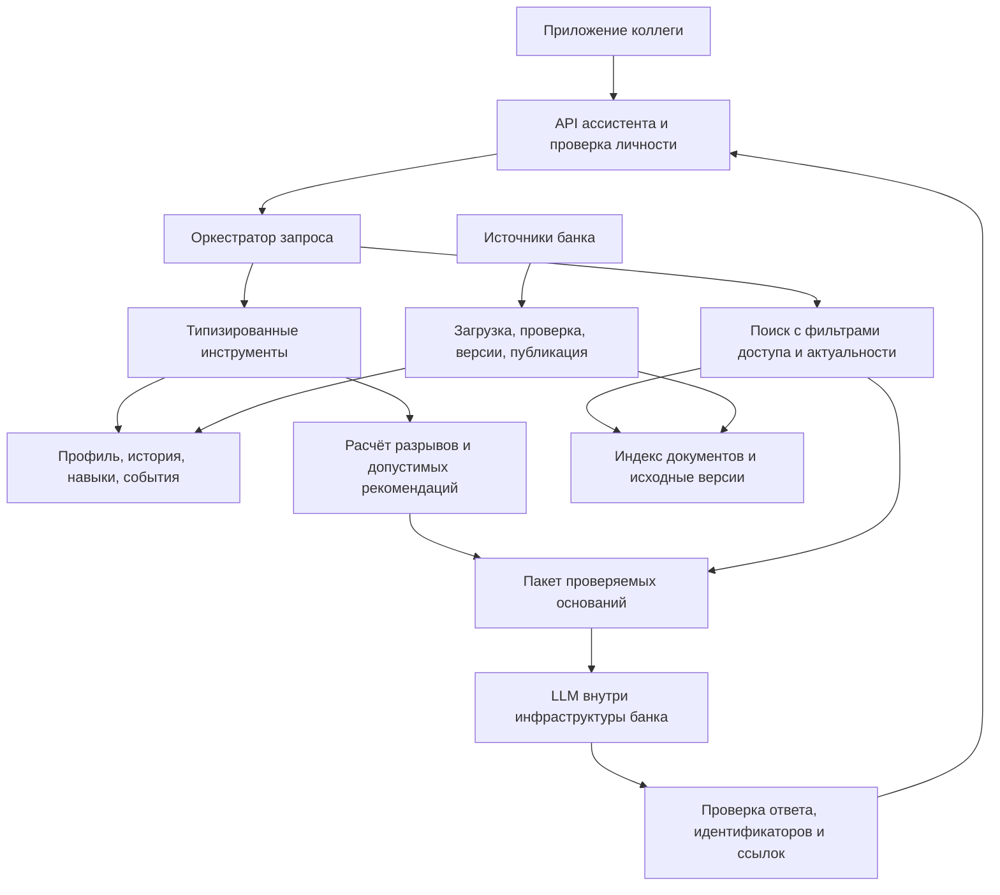

# Эскиз архитектуры и план подготовки RAG

Статус: предложение для обсуждения, 23 сентября 2026. Карта решений — [план](PLAN.md). Конкретные модели, библиотеки и база данных пока не выбраны: сначала ограничения инфраструктуры и измерения качества.

## 1. Что должен делать движок

Карьерный ассистент объясняет сотруднику его положение относительно цели, предлагает достижимые шаги и отвечает на вопросы по действующим внутренним документам. Качество означает правильную рекомендацию с проверяемыми основаниями, актуальными данными и соблюдением доступа.

| Сценарий сотрудника | Что должно произойти | Источник |
|---|---|---|
| «Что мешает мне стать Senior?» | Показать разрывы, критичные навыки и следующий шаг; соответствие навыкам не считать обещанием повышения | Профиль, требования роли, история |
| «У меня два часа в неделю. Что выбрать?» | Отфильтровать допустимые активности, учесть нагрузку и объяснить компромисс | Каталог, prerequisites, расписание, цель |
| «Почему предложен этот курс?» | Объяснить минимум три фактора и ожидаемый вклад в развитие | Расчёт и конкретные записи источников |
| «Я закончил курс — что изменилось?» | После подтверждённого события пересчитать прогресс один раз и показать изменение | Система участия, версия правил |
| «Какие три задачи ОТК мне выбрать?» | После подключения каталога предложить допустимый набор с объяснением, предложить подтверждение | Пул команды, правила квартала, профиль |
| «Какое правило действует в моём случае?» | Найти применимую действующую норму, привести цитату и ссылку; при нехватке данных сообщить об этом | Регламенты банка с ACL и версиями |
| Запрос HR | Вернуть разрешённые агрегаты по дефицитам навыков, участию и отсутствию следующего шага | Структурированные расчёты с разграничением доступа |

Сегодня доступны первые три сценария и расчёт прогресса на синтетических данных. Реальные ответы про ОТК и регламенты невозможны до загрузки соответствующих источников. Можно проектировать их интерфейсы, но нельзя выдавать демонстрационные тексты за правила банка.

## 2. Архитектурное предложение

Предлагаются четыре слоя:

1. **Состояние сотрудника и расчёты.** Точные запросы по идентификаторам и воспроизводимые вычисления навыков, допустимости и прогресса.
2. **Поиск знаний.** Полнотекстовый и семантический поиск по разрешённым действующим документам. Сочетание способов и повторное ранжирование выбираются на оценочном наборе.
3. **Ассистент.** Понимает намерение, запрашивает недостающую цель, вызывает ограниченный набор инструментов и объясняет результаты на языке пользователя.
4. **Контроль результата.** Проверяет ссылки, соответствие чисел расчётам и доступность рекомендуемых сущностей. Недостаток источников приводит к уточнению или честному ответу о нехватке данных.

Профили и журнал участия нужно читать из структурированного хранилища с проверкой доступа. Текстовые представления карточек навыков и курсов могут помогать поиску по смыслу; их идентификаторы затем проверяются по исходному каталогу. Загружать все персональные записи в общий векторный индекс не требуется.

## 3. Предлагаемая логика рекомендаций

1. Получить идентификатор сотрудника из доверенной авторизации, загрузить согласованный снимок профиля и истории.
2. Определить цель: явная цель сотрудника; при её отсутствии предложить следующий грейд или другое направление и уточнить желание сотрудника. Сохранять цель после его ответа — это поведение согласовано с пользователем. Для Lead не придумывать следующий уровень; при смене роли брать требования целевой роли.
3. Разделять последний оценённый уровень и расчётный уровень после завершённых активностей. Для датасета отсутствующий навык равен нулю; для банковской выгрузки отсутствие может означать «не оценён» и требует отдельного контракта.
4. Для каждого навыка применить только ещё не учтённые завершения после оценки, в определённом порядке. После согласования временной семантики — предложение формулы: `после = max(до, min(5, max_level, до + gain))`. Внешний `max` предотвращает снижение уже высокого навыка на базовом курсе.
5. Не применять gain для `in_progress`, `dropped`, `no_show`, `declined`, `overdue`. Не применять одну запись дважды. Правила повторяемости и даты завершения требуют решения: текущая колонка `date` не всегда означает окончание курса.
6. Вычислить `gap = max(0, требование - уровень)`; критичные разрывы показывать отдельно. Если вводится процент готовности, публиковать формулу и не интерпретировать его как вероятность повышения.
7. Отобрать добровольные активности: аудитория, prerequisites, незавершённость, правила повторов, доступность сессии относительно `as_of`, формат и ограничения времени. Обязательные активности отображать отдельными обязательствами.
8. Оценить вклад в целевые разрывы, критичность навыков, затраты времени, историю участия и предпочтения. Повторные пропуски — повод изменить формат или спросить причину; они не доказывают отсутствие мотивации. Не выдумывать порог score для начисления gain.
9. Выбрать 1–3 шага с разным полезным вкладом. Если подходящих нет — вернуть причину и возможный подготовительный шаг; не заполнять список недопустимыми курсами.
10. Дать LLM доступные кандидаты и основания. Возможное ранжирование LLM ограничить этими кандидатами и проверить после генерации. Сравнить с прозрачным базовым ранжированием; вклад AI должен быть измеримым.

Пример структуры обоснования: целевой грейд → текущий и требуемый навык → вклад конкретной активности → релевантная история или ограничение. Числа и идентификаторы берутся из расчёта, а не генерируются моделью.

Дата демонстрационного среза — `2026-10-01`, согласно README датасета. Это параметр `as_of` деморежима, а не изменение текущей календарной даты сервиса. Для пилота нужны фактические даты источников и часовой пояс. Уже в демонстрации нельзя называть расчётный уровень подтверждённой оценкой: точных дат завершения в исходном файле нет.

## 4. Как RAG помогает геймификации

RAG объясняет связь между действием и целью: «этот квест развивает навык, который нужен для выбранной роли», подтверждает ответ источником и помогает выбрать следующий шаг. Он также может объяснять правила ОТК и вознаграждений после их загрузки.

Приложение показывает личную траекторию и прогресс, предлагает добровольные задания и отображает подтверждённые достижения. Движок возвращает идентификаторы активностей, ожидаемое изменение навыков, основания и допустимые действия. Название квеста может генерироваться, но критерии завершения должны приходить из системы.

Согласно ТЗ кейса, геймификация опциональна; публичные рейтинги результативности и очки за обязательные процессы запрещены. Следовательно, проектировать личный прогресс и добровольные квесты. Начисление наград, подтверждение выполнения и запись задач ОТК должны выполняться транзакционной логикой приложения или существующей системы. Фраза сотрудника в чате сама по себе не подтверждает выполнение.

## 5. Какие данные подготовить

| Источник | Предпочтительный формат | Минимально необходимые поля |
|---|---|---|
| Профиль и оценка навыков | JSON/JSONL, CSV для плоских таблиц или API | стабильный employee_id, role_id, grade_id, подразделение, значения навыков, дата и источник оценки, версия |
| Матрица компетенций | JSON/CSV с отдельными строками требований | role_id, grade_id, skill_id, required_level, critical, версия, период действия |
| Обучение и мероприятия | JSON/API | event_id, описание, аудитория, prerequisites, gain/max_level, длительность, формат, сессии, доступность, recurrence |
| История участия | JSONL/CSV/API | record_id, employee_id, event_id, статус, occurred_at, completed_at, updated_at, источник подтверждения |
| Задачи ОТК | JSON/CSV/API | task_id, team_id, квартал, описание, условия участия, критерии приёмки, сроки, навыки при наличии подтверждённой связи, статус, версия |
| Правила ОТК и бонусов | Документ + метаданные | doc_id, владелец, редакция, область применения, даты действия, утверждение, связанные task_id при наличии |
| Регламенты | Markdown/HTML/DOCX или PDF с текстовым слоем | исходник, doc_id, название, версия, владелец, статус, даты действия, раздел, язык, ACL |
| Доступ | Доверенный API/выгрузка | субъект, роли, подразделения/группы, доступные ресурсы, срок действия разрешения |

Передавать исходные документы с сохранением заголовков, таблиц, нумерации и приложений. Сканированный PDF потребует OCR и контроля распознавания; сам OCR не делает извлечённый текст достоверным. Переводы связывать `translation_group_id`, указывать оригинальный язык и статус проверки перевода.

Метаданные документа: `source_id`, `doc_id`, `version`, `title`, `owner`, `status`, `effective_from`, `effective_to`, `updated_at`, `language`, `acl`, `checksum`, `source_uri`. Отдельно хранить время получения `ingested_at`; оно не заменяет дату вступления правила в силу. Семантику пустого `effective_to` и границ интервала определить в контракте.

Метаданные чанка: `chunk_id`, `doc_id`, `version`, `section_path`, номер страницы или абзаца, текст, наследуемый ACL, `content_hash`, версия парсера и chunking, версия embedding-модели. Ссылка должна открывать разрешённую пользователю версию исходника.

## 6. Как разбивать документы

Предлагаемый принцип — один связный смысловой фрагмент с контекстом раздела. Начальная гипотеза для эксперимента: 300–700 токенов на фрагмент, перекрытие 50–100 токенов только там, где разрыв теряет контекст. Это параметры проверки, не универсальный оптимум.

- Сохранять заголовок документа и путь раздела; правило, его условия и исключения стараться держать вместе.
- Большой раздел делить по абзацам; при выдаче при необходимости поднимать родительский раздел.
- Таблицу хранить с заголовками, единицами измерения и примечаниями; при разбиении повторять заголовки.
- Не смешивать в одном чанке версии, языки и разные права доступа.
- Короткая карточка курса или навыка может быть одним документом. Требования грейда хранить также структурированно для точного расчёта.
- Не превращать каждую строку журнала участия в текстовый чанк: журнал нужен для выборок и расчётов.
- Ссылки на другие пункты и приложения сохранять как связи, чтобы поиск не терял исключения.

Сравнить варианты на вопросах с длинными условиями, таблицами, исключениями и переключением русского/казахского. Выбирать разбиение по полноте найденных оснований и правильности ответов.

## 7. Обновление и отзыв данных

Предлагаемый цикл: получение → проверка схемы/ссылок → нормализация → версия источника → извлечение текста → чанки → индекс → проверка → атомарная публикация.

- Инкрементальная загрузка по watermark/updated_at и checksum; периодическая сверка полного состава. Повторный импорт идемпотентен.
- Изменение текста переиндексирует соответствующие фрагменты. Изменение ACL должно применяться независимо от переиндексации текста.
- Версия, вступающая в силу позже, не участвует в ответе на «что действует сейчас». Исторический запрос использует дату применимости.
- Удаление или отзыв документа закрывает выдачу, инвалидирует кэш и удаляет/скрывает чанки согласно политике хранения; ограничения проверяются также при чтении.
- Новую сборку индекса публиковать целиком после проверки; при сбое оставлять последнюю корректную версию с видимым временем актуальности.
- Профиль и участие обновлять из авторитетной системы. Изменение завершения вызывает пересчёт и инвалидацию рекомендаций; отмена завершения также должна пересчитываться.
- Ответ возвращает версии данных, правил и индекса. Ключ кэша учитывает сотрудника, права, цель, язык, дату и версии.
- Смена embedding-модели требует совместимой новой сборки индекса; откат должен восстанавливать согласованный комплект.

Нужно договориться о допустимом лаге обновлений. Отзыв доступа проверять в момент запроса, даже если поисковый индекс обновляется асинхронно.

## 8. Контракт с приложением коллеги

Предложение границы: приложение отвечает за интерфейс, авторизацию и подтверждённые бизнес-действия; сервис ассистента — за retrieval, расчёты и объяснения. Сервис самостоятельно проверяет права на каждом инструменте, не доверяя employee_id из текста сообщения.

Черновые операции для обсуждения:

- `POST /v1/chat` — вопрос, conversation_id, язык, необязательная цель; личность из доверенного токена.
- `GET /v1/me/development` — навыки, цель, разрывы, основания и дата состояния.
- `POST /v1/me/recommendations` — допустимые ограничения по времени/формату, 1–3 кандидата и объяснения.
- `GET /v1/hr/summary` — разрешённые агрегаты с фильтрами и областью доступа.
- Внутренний импорт и событие подтверждённого завершения — отдельный защищённый контракт с idempotency key и версией записи.

Ответ ассистента: `answer`, `recommendations[]`, `citations[]`, `data_as_of`, `data_version`, `rules_version`, `trace_id`, `warnings[]`, `proposed_actions[]`. Для рекомендации: `event_id`, `skill_gaps`, `expected_gain`, `reasons`, доступная сессия, ограничения. Citation содержит doc/record ID, версию, локатор и разрешённую ссылку; персональные основания не должны раскрывать чужие записи.

Состояния: успешный ответ, недостаточно данных, нет подходящих активностей, источник недоступен, недостаточно прав. Ошибка генерации не должна скрывать уже вычисленный профиль и рекомендации: допустим проверяемый шаблон объяснения с явной пометкой.

Для действия — сначала предложение и подтверждение пользователя, затем проверка прав и запись в авторитетную систему. Формат streaming, OpenAPI, примеры ответов и выбор владельца записи согласовать с коллегой до реализации.

## 9. Безопасность как часть архитектуры

Все компоненты inference, embeddings, reranking, хранилища, логи и резервные копии должны соответствовать подтверждённому ограничению «внутри инфраструктуры банка». Доступность такой среды ещё не подтверждена. Не закладывать скрытый fallback в облако.

Права проверяются до извлечения контекста и перед ответом. Руководителю нельзя автоматически дать доступ на основании одного `manager_id`; нужна политика. HR-агрегаты также могут раскрывать человека в малой группе — границу согласовать.

Тексты документов и сообщений — данные. Инструкции внутри найденного документа не меняют системные полномочия и не разрешают инструменты. Произвольный SQL, доступ к файловой системе и запись в кадровые системы не предоставлять модели. В журнале сохранять технический след и основания с минимизацией персонального содержимого.

При конфликте регламентов учитывать статус, период действия, область применения и иерархию источников, согласованную с владельцем. Если конфликт не разрешён — показывать его и направлять к ответственному; более новый файл сам по себе не всегда главнее.

## 10. Как доказать качество

«Лучший» движок выбирается по результатам на согласованном наборе, а не по числу компонентов. План приёмки:

| Проверка | Критерий / способ оценки |
|---|---|
| Импорт | Загружаются дополнительные профили и история той же схемы; ошибки объясняются |
| Расчёт | Результат совпадает с эталонными примерами; повтор события не удваивает gain; учитываются caps и дата оценки |
| Допустимость | Ни одна выданная активность не нарушает жёсткие ограничения на контрольном наборе |
| Персонализация | Критичный навык, история и цель влияют на выбор; объяснение содержит минимум три фактора согласно ТЗ |
| Поиск | Recall@k/MRR по размеченным вопросам и релевантным фрагментам; пороги определить после базового замера |
| Доказательность | Фактические утверждения поддержаны расчётом или цитатой; оценивать корректность и полноту citations |
| Доступ | Ноль успешных выдач чужих закрытых данных на отрицательных сценариях |
| Неопределённость | Честный ответ при отсутствующем регламенте, конфликте редакций или отсутствии кандидатов |
| Скорость | Из ТЗ: интерфейс до 2 с, AI-рекомендация до 10 с; зафиксировать нагрузку и измерять p50/p95, таймауты и долю нарушений |
| Воспроизводимость | Версии данных/правил/модели известны; запуск одной командой как требование будущей реализации |

Набор должен включать смену роли, Lead, отсутствие цели, недостающий навык, completed после оценки, одинаковые даты, повторные импорты, ограничения prerequisites, просроченное обучение, отсутствие будущих сессий, русско-казахские запросы, устаревший документ и попытку прочитать чужой профиль. Разделить набор настройки и отложенный набор; скрытые профили жюри не подменять собственными примерами.

Сравнения: прозрачные правила; правила с объяснением LLM; добавление поиска документов; гибридный поиск и reranker только при измеримом улучшении. Полезность RAG по регламентам можно оценить лишь после появления корпуса. Текущие четыре файла позволяют измерить рекомендации и расчёты.

## 11. Порядок следующих шагов

1. Завершить аудит датасета и обсудить границы демонстрации, языки и критерии.
2. Определить модель доступа и доступные ресурсы внутри банка.
3. Согласовать семантику прогресса и отбора рекомендаций на нескольких трудных профилях.
4. Согласовать контракт сервиса с коллегой и формат будущих источников.
5. Получить примеры ОТК и регламентов, определить chunking, обновления и правила применимости.
6. Сравнить допустимые варианты retrieval и моделей на контрольном наборе, зафиксировать выбор.
7. Закрыть архитектурные вопросы, подготовить спецификацию и затем перейти к реализации.

До получения внутренних документов может быть подготовлена архитектура адаптеров, но конкретная схема извлечения и качество RAG по банковским правилам остаются неподтверждёнными.
